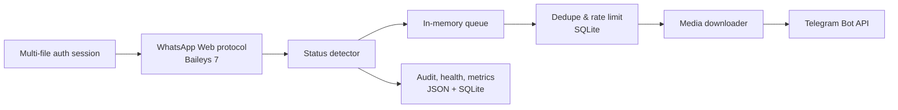

# Bot-Tele

Bot-Tele adalah layanan Node.js yang memantau status WhatsApp melalui koneksi Baileys, mengambil media status, kemudian meneruskannya secara otomatis ke Telegram. Bot dirancang untuk berjalan sebagai proses background di server, tanpa membutuhkan aplikasi desktop Telegram, WhatsApp Desktop, browser automation, atau sesi browser yang tetap terbuka.

> **Catatan penting:** Baileys tetap bertindak sebagai client protokol WhatsApp Web di level kode. Yang dihilangkan adalah ketergantungan pada client GUI atau browser, bukan kebutuhan untuk menautkan satu akun WhatsApp sebagai perangkat tertaut.

## Fitur saat ini

Implementasi saat ini menyediakan pemantauan status WhatsApp, pemrosesan gambar, video, audio, dokumen, stiker, dan teks, serta pengiriman otomatis ke Telegram Bot API. Sistem juga memiliki pairing code, penyimpanan sesi multi-file, reconnect otomatis, retry pengiriman, deduplikasi berbasis SQLite, queue in-memory, pembatasan laju forwarding, pencatatan audit, health state, backup sesi, anti-call, serta dukungan identitas PN/LID dari Baileys 7.

Notifikasi suara lokal sudah dihapus sepenuhnya. Bot tidak lagi membutuhkan file MP3, program pemutar suara, terminal bell, atau akses audio server.

## Penguatan penangkapan sinyal status

Pipeline capture sekarang menggunakan pendekatan **Node.js-only** tanpa Docker dan tanpa aplikasi GUI. Event `messages.upsert` dibedakan antara `notify` sebagai sinyal realtime dan `append` sebagai history/backfill. Batch `messaging-history.set` tetap diproses untuk menangkap status yang masuk ketika server sempat offline. Baileys mendokumentasikan bahwa history dikirim dalam beberapa batch dan bahwa `receivedPendingNotifications` menandai koneksi sudah menyelesaikan catch-up. [7]

Perubahan penguatan yang sudah diterapkan adalah sebagai berikut.

| Mekanisme | Perilaku |
|---|---|
| `messages.upsert` | Menangkap event realtime `notify` dan history `append` dengan jalur prioritas yang berbeda |
| `messaging-history.set` | Menyimpan batch history sebelum proses enqueue sehingga status tidak hilang saat fase catch-up |
| `receivedPendingNotifications` | Menunda pemrosesan normal sampai offline notification selesai dikirim |
| Fallback catch-up | Jika event penanda tidak datang, bot otomatis membuka pipeline setelah timeout terkonfigurasi |
| `getMessage` | Snapshot pesan disediakan ke Baileys untuk retry dekripsi dan pemulihan pesan |
| `messages.update` | Membangun kembali status dari snapshot ketika update tidak membawa payload message lengkap |
| Reconnect queue | Job berisi payload pesan dipertahankan sementara dan di-enqueue kembali ke socket baru |
| Persistent backlog | Job status juga ditulis ke tabel `pending_status_backlog` SQLite dan dimuat kembali setelah restart atau reconnect |
| History filter | Status history yang lebih tua dari `historyStatusMaxAgeHours` tidak diteruskan |
| Deduplikasi | Message ID, remote JID, participant, content signature, SQLite, dan queue key dipakai bersama |
| Auto-like verification | Reaction memakai key lengkap PN/LID dan log sukses hanya dibuat setelah echo reaction terkonfirmasi; jika timeout, status dicatat sebagai unconfirmed |

Baileys bersifat stateless dan tidak menyimpan message store permanen, sehingga aplikasi memang perlu menyediakan store sendiri untuk retry, history, dan state kontak. [8] Implementasi saat ini memakai cache bounded di memory untuk snapshot cepat dan SQLite untuk deduplikasi. Untuk volume besar atau multi-worker, queue persisten Redis/BullMQ tetap menjadi tahap lanjutan, bukan dependency wajib saat ini.

Parameter capture tersedia pada setiap preset di `config.js`:

```js
historyCaptureEnabled: true,
historyStatusMaxAgeHours: 24,
messageCacheLimit: 5000,
reconnectQueueRetentionMinutes: 30,
pendingNotificationsTimeoutSeconds: 20,
messageUpdateFallback: true,
likeVerificationEnabled: true,
likeVerificationTimeoutSeconds: 8
```

## Arsitektur saat ini



Baileys 7 bersifat ESM-only dan memperkenalkan beberapa perubahan besar, termasuk LID dan penghapusan ACK sukses. Karena proyek utama masih menggunakan CommonJS, `index.js` memuat Baileys dengan dynamic `import()` agar migrasi tidak perlu mengubah seluruh source code menjadi ESM. [2]

## Persyaratan

| Komponen | Persyaratan |
|---|---|
| Node.js | `>=26.0.0`; target yang telah diverifikasi: `v26.7.0` |
| npm | `>=11.0.0`; target yang telah diverifikasi: `11.19.0` |
| Sistem operasi | Linux server direkomendasikan; Windows dan macOS dapat dipakai untuk pengembangan |
| Akun WhatsApp | Satu akun yang dapat ditautkan sebagai perangkat tertaut |
| Telegram | Bot token dan chat ID tujuan |
| Database | SQLite melalui `better-sqlite3`; tidak membutuhkan server database pada mode single-instance |

Versi Node.js `v26.7.0` adalah rilis Current terbaru saat dokumentasi ini dibuat. [1]

## Instalasi lokal

Clone repositori, masuk ke direktori proyek, lalu pasang dependency menggunakan lockfile.

```bash
git clone https://github.com/JohnIsDimz/Bot-Tele.git
cd Bot-Tele
npm ci
```

Untuk pemeriksaan sintaks JavaScript:

```bash
npm test
```

Perintah `npm test` menjalankan `node --check` terhadap `index.js`, `node.js`, `runner.js`, dan `config.js`.

## Konfigurasi

Konfigurasi saat ini berada di `config.js`. Sebelum deployment, ubah sekurang-kurangnya bagian berikut:

> Jangan mengedit hanya preset `agresif` jika server berjalan dengan preset `normal`; ubah konstanta `AUTO_LIKE_EMOJI` di bagian paling atas `config.js` karena nilai tersebut digunakan bersama oleh semua preset.

```js
whatsapp: {
    phoneNumber: '628xxxxxxxxxx',
    authFolder: 'auth_info_baileys'
},

telegram: {
    botToken: '123456:token-telegram',
    chatId: '-100xxxxxxxxxx',
    requestTimeoutMs: 45000,
    maxRetries: 2,
    footerText: '© By John'
}
```

Jangan memasukkan token Telegram, nomor pribadi, file sesi, atau database runtime ke Git. Bot ini membaca konfigurasi operasional langsung dari `config.js`, sehingga perubahan konfigurasi harus dilakukan di file tersebut lalu proses bot harus di-restart.

Untuk mengganti emoji auto-like, cukup edit satu konstanta berikut di bagian paling atas `config.js`:

```js
const AUTO_LIKE_EMOJI = '🌹';
```

Nilai tersebut digunakan oleh preset aktif. Tidak diperlukan perubahan pada `index.js`. Setelah mengubah emoji, restart `runner.js` agar konfigurasi dimuat ulang.

Untuk `systemd`, gunakan unit Node.js biasa:

```ini
[Service]
ExecStart=/usr/bin/node /opt/bot-tele/runner.js
Restart=always
RestartSec=5
```

Konfigurasi yang paling sering disesuaikan adalah sebagai berikut.

| Bagian | Fungsi |
|---|---|
| `whatsapp` | Nomor pairing dan direktori sesi |
| `telegram` | Token bot, chat tujuan, timeout, retry, dan footer caption |
| `connection` | Reconnect, keep-online, sinkronisasi history, privacy, dan anti-call |
| `statusForwarder` | Jenis media, queue, persistent backlog, deduplikasi, batas ukuran, delay, rate limit, auto-like, dan verifikasi reaction |
| `operations` | Lokasi audit, metrics, health state, backup sesi, serta interval pemeriksaan |
| `console` | Mode log dan detail log pengiriman, like, serta panggilan |

## Anti-call

Bot menolak panggilan masuk secara otomatis dan membedakan pesan untuk panggilan suara serta panggilan video. Pesan dapat diedit di bagian `connection.antiCall` pada `config.js`.

```js
busyMessageVoice: 'Mohon maaf, panggilan suara WhatsApp otomatis ditolak karena bot sedang tidak menerima panggilan. Silakan kirim pesan chat jika membutuhkan bantuan.',
busyMessageVideo: 'Mohon maaf, panggilan video WhatsApp otomatis ditolak karena bot sedang tidak menerima panggilan. Silakan kirim pesan chat jika membutuhkan bantuan.'
```

Jika panggilan berasal dari grup, panggilan tetap ditolak tetapi bot tidak mengirim pesan otomatis ke grup. Setiap penolakan dicatat ke audit dan metrics.

## Format notifikasi alert

Notifikasi operasional sekarang menggunakan format terstruktur agar detail sesi, status, waktu, dan tindakan berikutnya mudah dibaca. Contoh untuk logout WhatsApp:

```text
ALERT BOT
━━━━━━━━━━━━━━━━━━━━
Jenis    : SESI LOGOUT
Status   : Sesi WhatsApp tidak terautentikasi
Detail   : Kode status: 401 (Unauthorized)
Waktu    : 25/08/2026 01.35.52 WIB
Tindakan : Pairing ulang WhatsApp diperlukan sebelum bot dapat bekerja kembali.
━━━━━━━━━━━━━━━━━━━━
```

## Menjalankan bot

Jalankan runner yang akan memulai ulang proses bot ketika terjadi exit yang tidak diharapkan.

```bash
npm start
```

Untuk menjalankan entrypoint secara langsung ketika debugging:

```bash
npm run bot
```

Pada first run, bot membuat state autentikasi di `auth_info_baileys` dan menampilkan pairing code sesuai alur yang digunakan konfigurasi. Setelah sesi tersimpan, proses berikutnya dapat berjalan tanpa pairing ulang selama sesi masih valid.

## Format caption Telegram

Caption sudah dirapikan agar konsisten untuk pesan teks dan seluruh media. Contoh formatnya:

```text
STATUS WHATSAPP BARU

Pengirim : Nama Kontak
ID       : 628xxxxxxxxxx@s.whatsapp.net
Jenis    : IMAGE
Kategori : STATUS_BROADCAST
Waktu    : 25/08/2026 14.30.00 WIB
Sumber   : Saluran Contoh

ISI STATUS
───────────
Teks caption dari status WhatsApp ditampilkan di sini.

───────────
© By John
```

Perilaku formatter caption:

1. Nama field diratakan supaya metadata mudah dibaca.
2. Kategori seperti `status_broadcast` diubah menjadi `STATUS BROADCAST`.
3. Waktu status asli digunakan jika tersedia; jika tidak, formatter memakai waktu forwarding.
4. Spasi berulang, carriage return, dan baris kosong berlebihan dinormalisasi.
5. Caption media dibatasi sampai 1024 karakter sesuai batas caption media Telegram, sedangkan pesan teks menggunakan batas 4096 karakter. [3]
6. Caption kosong tidak membuat blok `ISI STATUS` yang tidak perlu.
7. Formatter tidak menggunakan Markdown atau HTML parse mode, sehingga karakter caption dari pengguna tidak rusak karena dianggap sebagai markup.

Telegram Bot API menggunakan HTTPS dan mendukung JSON untuk request biasa serta multipart/form-data untuk upload media. [3]

## File dan state runtime

Status yang terdeteksi tetapi belum selesai diteruskan disimpan di tabel SQLite `pending_status_backlog`. Payload diserialisasi menggunakan serializer bawaan Node.js agar field binary pada media dan key PN/LID dapat dipulihkan. Setelah socket menerima `receivedPendingNotifications`, bot memuat backlog tersebut, melewati status yang sudah kedaluwarsa, lalu mengirimkannya melalui queue dengan socket yang aktif. Row backlog baru dihapus setelah task selesai atau dilewati secara permanen; kegagalan sementara tetap meninggalkan row untuk recovery berikutnya.

Untuk auto-like, status reaction memakai `sock.sendMessage('status@broadcast', { react: { text, key } }, { statusJidList })` dengan key status asli dan alias participant PN/LID yang tersedia. Baileys mendukung format reaction umum dengan key pesan dan mendefinisikan `statusJidList` sebagai daftar participant untuk relay status. [9] Karena promise berhasil tidak selalu membuktikan reaction sudah terlihat di WhatsApp, bot menunggu event echo `messages.reaction` atau own reaction event. Console tidak lagi menulis `liked` sebelum verifikasi; hasil yang timeout dicatat sebagai `status_like_sent_unconfirmed`.

File berikut dapat dibuat ketika bot berjalan dan sebaiknya tidak di-commit:

| Path atau pola | Keterangan |
|---|---|
| `auth_info_baileys/` | Kredensial dan state sesi WhatsApp |
| `auth_backups/` | Backup sesi |
| `status-antispam.db*` | Database SQLite untuk deduplikasi dan state |
| `healthcheck.json` | Status health runtime |
| `metrics.json` | Counter operasional |
| `audit-log.json` | Audit event |
| `failed-jobs.json` | Pekerjaan gagal dan alasan kegagalan |
| `runtime-state.json` | Snapshot state runtime |
| `contact-store.json` | Cache kontak |
| `status-reference-store.json` | Referensi status |
| `pending_status_backlog` di SQLite | Payload status yang belum selesai diteruskan |
| `blocked-callers.json` | Daftar caller yang diblokir |

Backup file-file tersebut secara berkala, terutama `auth_info_baileys/`, `auth_backups/`, dan `status-antispam.db`.

## Deployment server tanpa client GUI

Bot dapat berjalan sebagai satu proses background di VPS atau server Linux. Tidak diperlukan Telegram Desktop, WhatsApp Desktop, browser, atau remote desktop. Akun WhatsApp cukup ditautkan sekali melalui pairing, setelah itu runner mengelola proses reconnect dan restart.

Dua pola deployment yang layak dipakai adalah sebagai berikut.

| Approach | Tradeoffs | Cost | Setup Complexity |
|---|---|---|---|
| `systemd` pada VPS | Ringan, native Linux, mudah memakai volume lokal; konfigurasi bergantung pada OS server | Biaya VPS yang digunakan | Rendah–menengah |
| Process manager seperti PM2 | Praktis untuk restart, log, dan startup; menambah satu lapisan tooling | Biaya VPS yang digunakan | Rendah–menengah |

Untuk satu instance dengan SQLite, `systemd` atau PM2 sudah cukup. Keduanya menjalankan proses Node.js langsung di host, sehingga tidak ada lapisan container yang perlu dipelihara. Untuk deployment production, `systemd` direkomendasikan sebagai baseline karena tersedia pada Linux dan dapat menjalankan restart policy, environment variable, serta log melalui journal.

Contoh unit `systemd` minimal:

```ini
[Unit]
Description=Bot-Tele WhatsApp to Telegram
After=network-online.target
Wants=network-online.target

[Service]
Type=simple
User=bottele
WorkingDirectory=/opt/bot-tele
ExecStart=/usr/bin/node /opt/bot-tele/runner.js
Restart=always
RestartSec=5
Environment=NODE_ENV=production

[Install]
WantedBy=multi-user.target
```

Aktifkan service setelah menyesuaikan path dan user server:

```bash
sudo systemctl daemon-reload
sudo systemctl enable --now bot-tele
sudo systemctl status bot-tele
journalctl -u bot-tele -f
```

Untuk production, jalankan bot dengan user non-root, simpan secret di luar repositori, batasi permission folder sesi, dan gunakan backup terenkripsi.

## Roadmap teknologi yang direkomendasikan

Tidak semua teknologi perlu ditambahkan sekaligus. Urutan berikut menjaga proyek tetap sederhana sambil meningkatkan kestabilan secara bertahap.

### Prioritas 1: API health dan kontrol operasional

Tambahkan server HTTP ringan menggunakan Fastify untuk endpoint berikut:

| Endpoint | Fungsi |
|---|---|
| `GET /health/live` | Memastikan proses masih hidup |
| `GET /health/ready` | Memastikan sesi WhatsApp, SQLite, dan dependency penting siap |
| `GET /metrics` | Counter forwarding, retry, queue, reconnect, dan error |
| `GET /api/v1/status` | Ringkasan status koneksi dan queue tanpa membocorkan secret |
| `POST /api/v1/reload` | Memuat ulang konfigurasi yang aman untuk diubah |
| `POST /api/v1/retry/:jobId` | Menjalankan ulang pekerjaan gagal tertentu |

Fastify cocok untuk lapisan API kecil karena memiliki plugin architecture, schema validation, dan integrasi logging berbasis Pino. [4] Endpoint management wajib dilindungi authentication, rate limit, dan idealnya hanya dibuka melalui jaringan internal atau reverse proxy HTTPS.

### Prioritas 2: Secret management dan validasi konfigurasi

Pindahkan token, chat ID, nomor pairing, dan path penting ke environment variable. Tambahkan schema validation saat startup agar bot berhenti dengan pesan yang jelas jika secret atau konfigurasi tidak valid. Untuk server cloud, gunakan secret manager bawaan provider; untuk VPS sederhana, gunakan file environment dengan permission ketat dan jangan commit file tersebut.

### Prioritas 3: Queue persisten

Queue saat ini berada di memory proses. Ini cukup untuk satu instance dan volume rendah, tetapi pekerjaan yang sedang menunggu dapat hilang ketika proses crash. Jika volume status meningkat, gunakan Redis dan BullMQ agar tersedia delayed job, retry, concurrency, prioritas, dan recovery setelah crash. [5]

Rancangan queue yang disarankan adalah `status-detected`, `media-download`, `telegram-send`, dan `dead-letter`. Setiap job harus memiliki idempotency key dari kombinasi remote JID, message ID, tipe media, dan content signature.

### Prioritas 4: Observability

Pertahankan log Pino dalam format JSON untuk server. Tambahkan request ID, session ID yang sudah disamarkan, job ID, latency, retry count, dan error code. Ekspor metrics ke Prometheus dan buat dashboard Grafana untuk reconnect, queue depth, forwarding success rate, media download latency, Telegram error rate, dan usia job tertua.

### Prioritas 5: Database dan storage yang siap scale

SQLite tetap pilihan tepat untuk single-instance. Jika bot menjadi multi-session, multi-worker, atau multi-server, migrasikan state terstruktur ke PostgreSQL. Media sementara sebaiknya memiliki lifecycle cleanup; bila perlu retry lintas proses atau audit media, gunakan object storage kompatibel S3 dengan retention policy.

### Prioritas 6: Security boundary

Tambahkan reverse proxy HTTPS, firewall, allowlist jaringan untuk endpoint admin, API key atau JWT untuk management API, rate limiting, audit trail, dan redaction terhadap token serta nomor telepon pada log. Jangan pernah mengembalikan isi credential, pairing secret, atau full JID sensitif melalui endpoint publik.

### Prioritas 7: Testing dan release automation

Tambahkan unit test untuk parser status, formatter caption, deduplikasi, rate limit, dan retry. Node.js built-in test runner dapat menjadi pilihan ringan sebelum menambah framework lain. Setelah itu tambahkan integration test dengan mock Telegram API, smoke test Baileys import, `npm ci`, `npm audit`, dan verifikasi native addon `better-sqlite3` pada Node.js 26.

## Batasan arsitektur yang perlu dipahami

Telegram Bot API cocok untuk mengirim media dan caption secara otomatis. Untuk penerimaan update Telegram, gunakan webhook atau long polling; keduanya saling eksklusif dan update Telegram memiliki masa penyimpanan terbatas. [3]

WhatsApp Cloud API resmi perlu diperlakukan sebagai integrasi berbeda, bukan pengganti langsung Baileys untuk fungsi membaca status personal. Jika kebutuhan berubah menjadi business messaging resmi, inbound webhook, template message, dan pengiriman pesan ke pelanggan, Cloud API layak dievaluasi melalui dokumentasi resmi Meta. Untuk fungsi inti proyek saat ini—mendeteksi dan meneruskan status WhatsApp—Baileys tetap merupakan komponen yang digunakan dan perlu dipantau terhadap perubahan protokol serta kebijakan WhatsApp. [6]

## Troubleshooting

| Gejala | Pemeriksaan |
|---|---|
| Bot restart terus | Periksa `journalctl`, `failed-jobs.json`, dan validasi isi `config.js` |
| Pairing berulang | Pastikan folder `auth_info_baileys/` persisten dan writable oleh user service |
| Caption media terpotong | Batas media Telegram adalah 1024 karakter; detail panjang sebaiknya dikirim sebagai pesan teks lanjutan |
| SQLite gagal dibuka | Pastikan native dependency terpasang pada Node.js target dan folder database writable |
| Telegram gagal mengirim | Periksa token, chat ID, permission bot, timeout, dan response description dari Bot API |
| Status terduplikasi | Periksa `status-antispam.db`, content signature, message ID, dan queue retry |
| Server kehabisan memory | Turunkan history sync, batasi queue/media size, dan pertimbangkan Redis queue atau worker terpisah |

## Perintah pengembangan

```bash
npm ci       # instalasi deterministik dari package-lock.json
npm test     # pemeriksaan sintaks
npm start    # menjalankan runner dengan auto-restart
npm run bot  # menjalankan bot langsung
```

## Dependency utama

| Package | Peran |
|---|---|
| `@whiskeysockets/baileys` | Koneksi WhatsApp Web protocol dan event status |
| `@hapi/boom` | Pemeriksaan disconnect error WhatsApp |
| `better-sqlite3` | Deduplikasi dan storage state lokal |
| `node-cache` | Cache dan rate limit in-memory |
| `pino` | Logger runtime |

Versi dependency dikunci di `package-lock.json`. Jalankan `npm outdated` dan `npm audit` secara berkala, kemudian uji pada Node.js 26 sebelum melakukan upgrade mayor.

## Referensi

[1]: https://nodejs.org/en/download/current "Node.js Current Downloads"

[2]: https://baileys.wiki/migration/v7 "Baileys v7 Migration Guide"

[3]: https://core.telegram.org/bots/api "Telegram Bot API"

[4]: https://fastify.dev/ "Fastify — Fast and low-overhead web framework"

[5]: https://docs.bullmq.io/ "BullMQ Documentation"

[6]: https://whatsappbusiness.com/developers/developer-hub/ "WhatsApp Business Developer Hub"

[7]: https://baileys.wiki/concepts/events "Baileys Events"

[8]: https://baileys.wiki/concepts/data-store "Baileys Data Store"

[9]: https://github.com/WhiskeySockets/Baileys/blob/master/README.md "Baileys README — Reaction Message"
